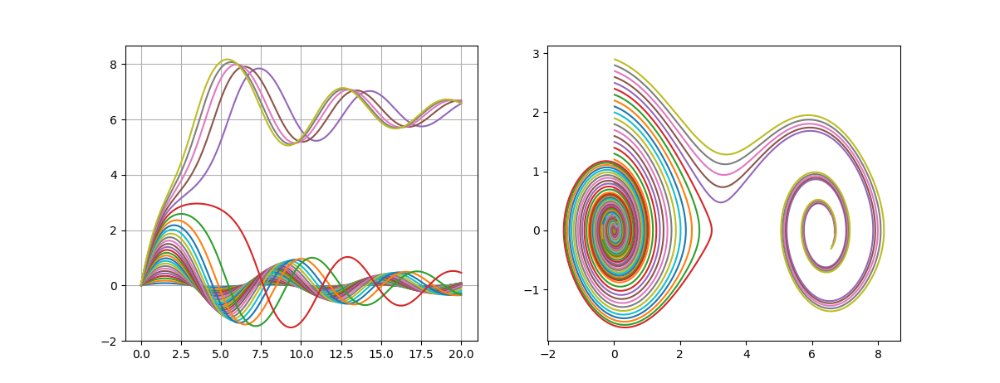
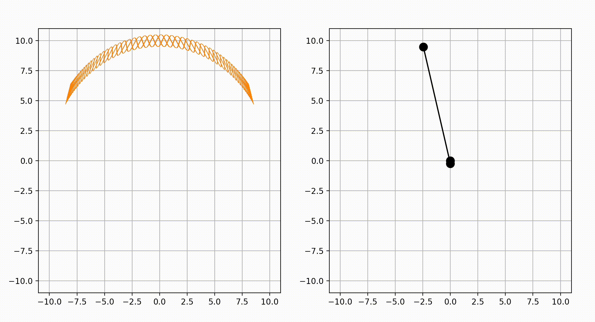
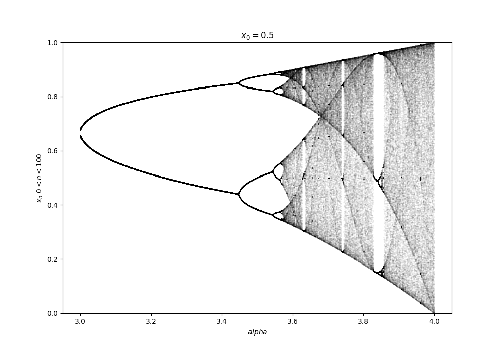

# Numerical sumilution of physical processes
This is my repository for small college projects

## Cauchy problem solver
A tool for numerical solving arbitary Cauchy problem and comparison of different solving methods.
Euler, Heun, Runge-Kutta methods are implemented. 
Arbitary type and vector-structure can be used via templets, which also allows to choose direct or kahan summation.
Examples are below.

Phase porter of physucal pendulum:

Trajectory and animation of Kapitza's pendulum

## Simulation of one-dimensional gas

## Logistic equation

